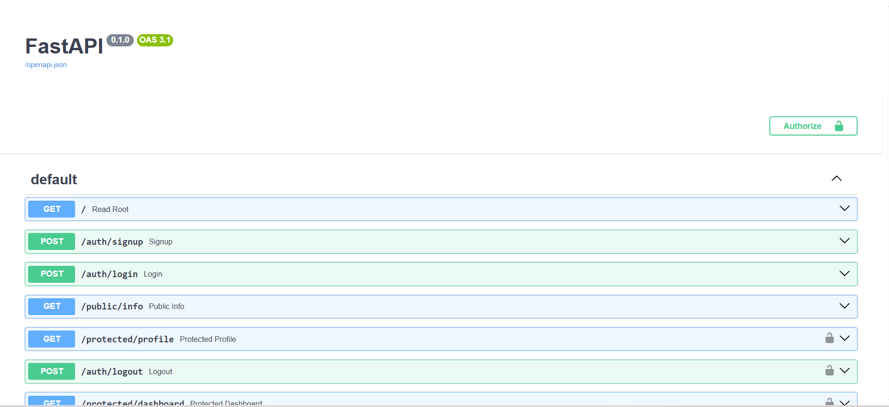

# 🛡️ Secure Auth API (Python / FastAPI)

## Overview
This project is a secure backend API that handles user authentication (Sign Up, Log In, and Log Out) and protects specific routes using robust middleware. Rather than rolling our own cryptography, this API uses **Supabase Auth** as the Identity Provider (IdP) to manage user accounts and issue secure JSON Web Tokens (JWTs).

It was built with **Python 3** and **FastAPI**.

## Features
- **Open Auth (Sign Up / Log In)**: Users can securely register and authenticate via Supabase.
- **JWT Authentication**: Protects "doors" using JSON Web Tokens.
- **Middleware Guard**: A reusable FastAPI dependency extracts, validates, and verifies tokens automatically for protected endpoints.
- **Public & Protected Routes**: Differentiates between open data and data requiring a verified JWT.
- **Swagger UI**: Interactive API documentation with built-in Bearer Token authorization capabilities.

## 🚀 Setup & Running Locally

A peer can clone this repository, plug in their own `.env` values, and run this authenticated API in under 5 minutes.

### 1. Prerequisites
- Python 3.10+
- A free [Supabase](https://supabase.com/) account.

### 2. Configure Environment Variables
Create a file named `.env` in the root directory. **(Note: This file is ignored by Git to keep your secrets safe).** Add your Supabase project credentials:

```env
SUPABASE_URL=https://your-project-url.supabase.co
SUPABASE_KEY=your_publishable_anon_key
PORT=8000
```

### 3. Installation
Create and activate a virtual environment, then install the dependencies:
```bash
python -m venv venv
# On Windows PowerShell:
.\venv\Scripts\Activate.ps1
# On Mac/Linux:
source venv/bin/activate

pip install -r requirements.txt
```

### 4. Running the Server
Start the FastAPI development server:
```bash
python -m uvicorn main:app --port 8000 --reload
```
The API will be available at `http://localhost:8000`.

---

## 🗺️ API Reference

| Endpoint | Method | Auth Required | Description |
| --- | --- | --- | --- |
| `/auth/signup` | POST | ❌ No | Register a new user account. Returns `201 Created`. |
| `/auth/login` | POST | ❌ No | Authenticate user & return the Access Token (JWT). Returns `200 OK`. |
| `/public/info` | GET | ❌ No | Read public, unprotected data. |
| `/protected/profile` | GET | 🔒 Yes | Read private user profile data. Requires `Authorization: Bearer <token>`. |
| `/protected/dashboard`| GET | 🔒 Yes | Access a protected dashboard view. Requires `Authorization: Bearer <token>`. |
| `/auth/logout` | POST | 🔒 Yes | Terminate the user session. Returns `204 No Content`. |

---

## 📸 Swagger UI
FastAPI automatically generates an interactive documentation page. By configuring `HTTPBearer`, we unlocked the **Authorize** lock button, allowing us to easily test our protected routes directly from the browser!



---

## 🤖 AI vs Me (Stage 7 Analysis)
*To be filled out during Stage 7.*

- **How the AI handled token extraction**: ...
- **Security flaws it might have introduced**: ...
- **What your prompt missed and what the AI assumed**: ...
